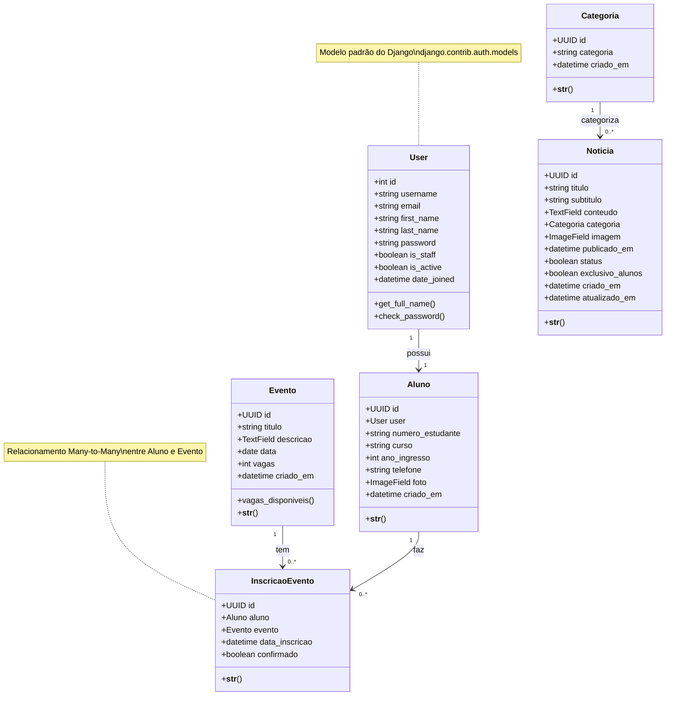
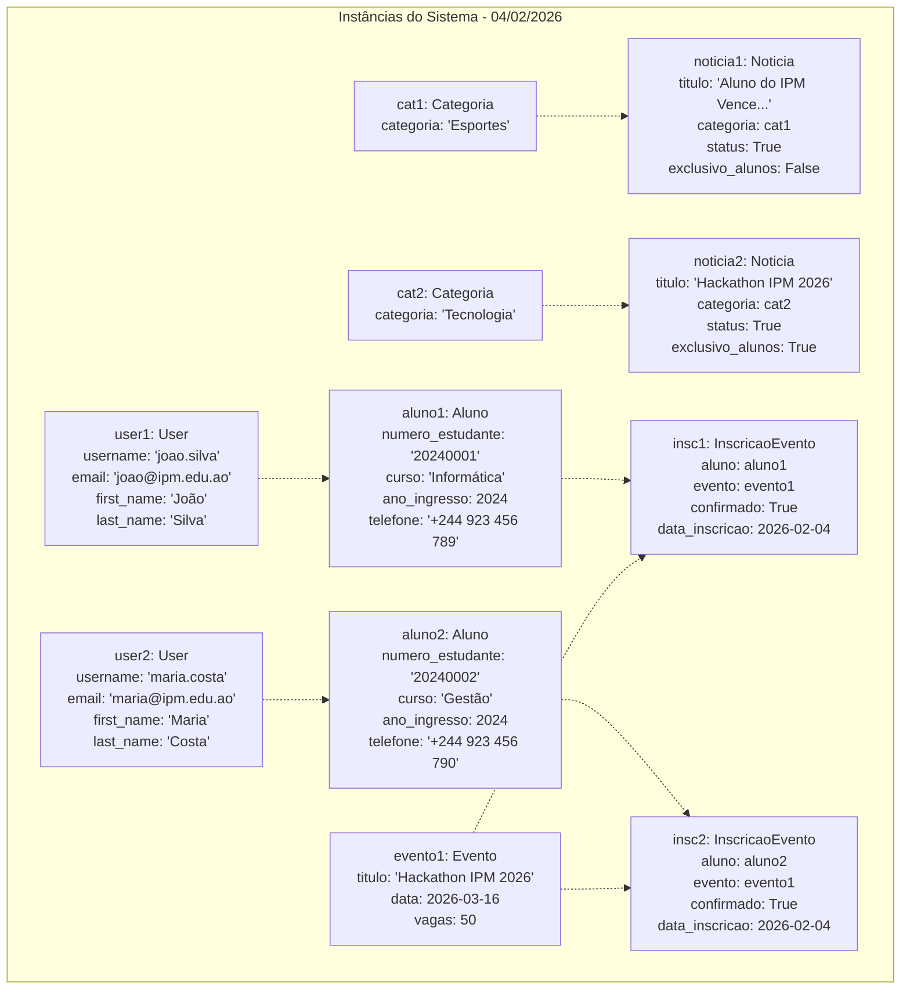
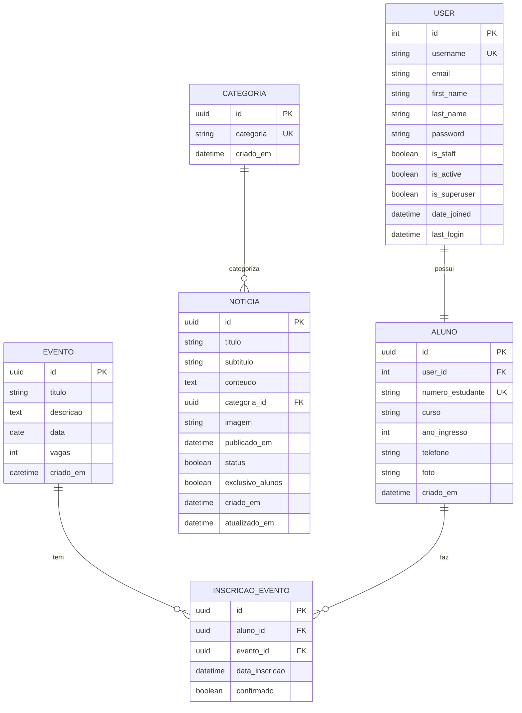
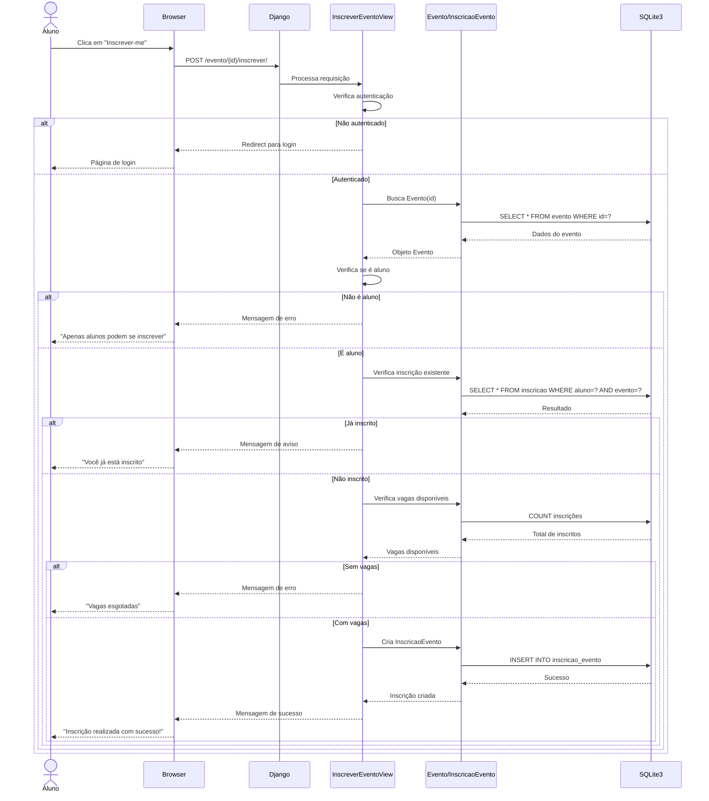
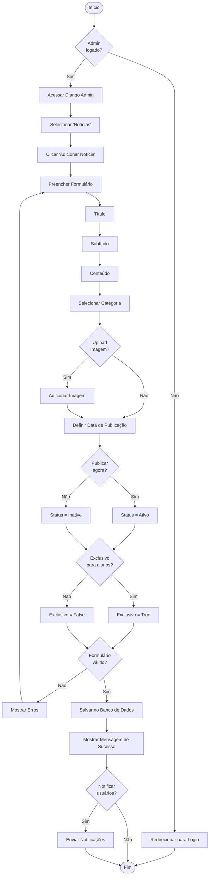

# 📊 DIAGRAMAS UML DO SISTEMA
## Portal de Notícias IPM

**Data:** 04 de Fevereiro de 2026  
**Versão:** 2.0 (Atualizada)  
**Status:** Sistema em Produção (95% completo)

---

## 📋 ÍNDICE

1. [Diagrama de Casos de Uso](#diagrama-de-casos-de-uso)
2. [Diagrama de Classes](#diagrama-de-classes)
3. [Diagrama de Objetos](#diagrama-de-objetos)
4. [Diagrama Entidade-Relacionamento (ER)](#diagrama-entidade-relacionamento)
5. [Diagrama de Implementação](#diagrama-de-implementação)
6. [Diagrama de Sequência](#diagrama-de-sequência)
7. [Diagrama de Atividades](#diagrama-de-atividades)

---

## 1. DIAGRAMA DE CASOS DE USO

### Descrição
Representa as funcionalidades do sistema e como os diferentes atores interagem com elas.

### Atores
- **Visitante**: Usuário não autenticado
- **Aluno**: Usuário autenticado (estudante do IPM)
- **Administrador**: Gestor do sistema

```mermaid
graph TB
    subgraph "Portal de Notícias IPM"
        %% Casos de Uso - Visitante
        UC1[Visualizar Notícias Públicas]
        UC2[Filtrar Notícias por Categoria]
        UC3[Ver Detalhes da Notícia]
        UC4[Visualizar Eventos]
        UC5[Ver Detalhes do Evento]
        UC6[Criar Conta de Aluno]
        UC7[Fazer Login]
        
        %% Casos de Uso - Aluno
        UC8[Visualizar Notícias Exclusivas]
        UC9[Inscrever-se em Evento]
        UC10[Cancelar Inscrição]
        UC11[Ver Minhas Inscrições]
        UC12[Visualizar Meu Perfil]
        UC13[Fazer Logout]
        
        %% Casos de Uso - Admin
        UC14[Criar Notícia]
        UC15[Editar Notícia]
        UC16[Excluir Notícia]
        UC17[Criar Evento]
        UC18[Editar Evento]
        UC19[Excluir Evento]
        UC20[Gerenciar Categorias]
        UC21[Gerenciar Alunos]
        UC22[Ver Inscritos em Evento]
    end
    
    %% Atores
    Visitante((Visitante))
    Aluno((Aluno))
    Admin((Administrador))
    
    %% Relacionamentos - Visitante
    Visitante --> UC1
    Visitante --> UC2
    Visitante --> UC3
    Visitante --> UC4
    Visitante --> UC5
    Visitante --> UC6
    Visitante --> UC7
    
    %% Relacionamentos - Aluno (herda de Visitante)
    Aluno --> UC1
    Aluno --> UC2
    Aluno --> UC3
    Aluno --> UC4
    Aluno --> UC5
    Aluno --> UC8
    Aluno --> UC9
    Aluno --> UC10
    Aluno --> UC11
    Aluno --> UC12
    Aluno --> UC13
    
    %% Relacionamentos - Admin
    Admin --> UC14
    Admin --> UC15
    Admin --> UC16
    Admin --> UC17
    Admin --> UC18
    Admin --> UC19
    Admin --> UC20
    Admin --> UC21
    Admin --> UC22
    
    %% Extends e Includes
    UC9 -.->|extends| UC5
    UC10 -.->|extends| UC11
    UC3 -.->|includes| UC2
```



### Descrição dos Casos de Uso

#### **Visitante:**
1. **UC1 - Visualizar Notícias Públicas**: Ver lista de notícias não exclusivas
2. **UC2 - Filtrar Notícias por Categoria**: Filtrar notícias por categoria específica
3. **UC3 - Ver Detalhes da Notícia**: Visualizar conteúdo completo de uma notícia
4. **UC4 - Visualizar Eventos**: Ver lista de eventos (próximos e passados)
5. **UC5 - Ver Detalhes do Evento**: Visualizar informações completas do evento
6. **UC6 - Criar Conta de Aluno**: Registrar-se como aluno no sistema
7. **UC7 - Fazer Login**: Autenticar-se no sistema

#### **Aluno (herda funcionalidades do Visitante):**
8. **UC8 - Visualizar Notícias Exclusivas**: Acessar notícias marcadas como exclusivas
9. **UC9 - Inscrever-se em Evento**: Fazer inscrição em evento com vagas disponíveis
10. **UC10 - Cancelar Inscrição**: Cancelar inscrição em evento
11. **UC11 - Ver Minhas Inscrições**: Listar todos os eventos inscritos
12. **UC12 - Visualizar Meu Perfil**: Ver dados pessoais e histórico
13. **UC13 - Fazer Logout**: Sair do sistema

#### **Administrador:**
14. **UC14 - Criar Notícia**: Adicionar nova notícia ao sistema
15. **UC15 - Editar Notícia**: Modificar notícia existente
16. **UC16 - Excluir Notícia**: Remover notícia do sistema
17. **UC17 - Criar Evento**: Adicionar novo evento
18. **UC18 - Editar Evento**: Modificar evento existente
19. **UC19 - Excluir Evento**: Remover evento
20. **UC20 - Gerenciar Categorias**: CRUD de categorias de notícias
21. **UC21 - Gerenciar Alunos**: Visualizar e gerenciar alunos cadastrados
22. **UC22 - Ver Inscritos em Evento**: Listar alunos inscritos em cada evento

---

## 2. DIAGRAMA DE CLASSES

### Descrição
Representa a estrutura estática do sistema, mostrando classes, atributos, métodos e relacionamentos.



### Detalhamento das Classes

#### **User (Django Auth)**
- Modelo padrão do Django para autenticação
- Gerencia credenciais e permissões

#### **Aluno**
- Estende User com informações acadêmicas
- Relacionamento OneToOne com User
- Armazena dados específicos do estudante

#### **Categoria**
- Classifica notícias por tema
- Relacionamento OneToMany com Notícia

#### **Noticia**
- Conteúdo principal do portal
- Pode ser pública ou exclusiva para alunos
- Possui categoria, imagem e status

#### **Evento**
- Eventos institucionais do IPM
- Controla vagas disponíveis
- Método `vagas_disponiveis()` calcula vagas restantes

#### **InscricaoEvento**
- Tabela de associação entre Aluno e Evento
- Implementa Many-to-Many com dados extras
- Unique constraint: um aluno não pode se inscrever duas vezes no mesmo evento

---

## 3. DIAGRAMA DE OBJETOS

### Descrição
Mostra instâncias específicas das classes em um momento particular do sistema.



### Cenário Representado
- **2 Alunos** cadastrados no sistema
- **2 Categorias** de notícias
- **2 Notícias** publicadas (1 pública, 1 exclusiva)
- **1 Evento** (Hackathon IPM 2026)
- **2 Inscrições** no evento

---

## 4. DIAGRAMA ENTIDADE-RELACIONAMENTO (ER)

### Descrição
Modelo de dados do banco de dados relacional (SQLite3).



### Cardinalidades e Restrições

#### **USER ↔ ALUNO** (1:1)
- Um User possui exatamente um Aluno
- Um Aluno pertence a exatamente um User
- `ON DELETE CASCADE`: Se User for deletado, Aluno também é

#### **CATEGORIA ↔ NOTICIA** (1:N)
- Uma Categoria pode ter várias Notícias
- Uma Notícia pertence a uma Categoria
- `ON DELETE PROTECT`: Não pode deletar Categoria com Notícias

#### **EVENTO ↔ INSCRICAO_EVENTO** (1:N)
- Um Evento pode ter várias Inscrições
- Uma Inscrição pertence a um Evento
- `ON DELETE CASCADE`: Se Evento for deletado, Inscrições também são

#### **ALUNO ↔ INSCRICAO_EVENTO** (1:N)
- Um Aluno pode ter várias Inscrições
- Uma Inscrição pertence a um Aluno
- `ON DELETE CASCADE`: Se Aluno for deletado, Inscrições também são

#### **Constraints Únicos:**
- `USER.username`: Único
- `ALUNO.numero_estudante`: Único
- `CATEGORIA.categoria`: Único
- `INSCRICAO_EVENTO(aluno_id, evento_id)`: Único (um aluno não pode se inscrever duas vezes no mesmo evento)

---

## 5. DIAGRAMA DE IMPLEMENTAÇÃO

### Descrição
Mostra a arquitetura física do sistema, componentes de hardware e software.

```mermaid
graph TB
    subgraph "Cliente - Navegador Web"
        Browser[Navegador<br/>Chrome/Firefox/Edge]
        HTML[HTML5]
        CSS[CSS3]
        JS[JavaScript]
        
        Browser --> HTML
        Browser --> CSS
        Browser --> JS
    end
    
    subgraph "Servidor Web - Windows"
        subgraph "Django Application Server"
            Django[Django 5.2.7<br/>Python 3.11]
            
            subgraph "Apps Django"
                PagesApp[pages app]
                CoreApp[core app]
            end
            
            subgraph "Middleware"
                Auth[Authentication]
                Session[Session Management]
                CSRF[CSRF Protection]
                Static[Static Files]
            end
            
            subgraph "Templates"
                Jinja[Django Templates]
            end
            
            Django --> PagesApp
            Django --> CoreApp
            Django --> Auth
            Django --> Session
            Django --> CSRF
            Django --> Static
            Django --> Jinja
        end
        
        subgraph "Admin Interface"
            Jazzmin[Django Jazzmin<br/>Admin Theme]
        end
        
        subgraph "Banco de Dados"
            SQLite[(SQLite3<br/>projecto_fim_curso.sqlite3)]
        end
        
        subgraph "Arquivos Estáticos"
            StaticFiles[/static/<br/>CSS, JS, Images]
            MediaFiles[/media/<br/>Uploads]
        end
    end
    
    subgraph "Bibliotecas Python"
        Pillow[Pillow<br/>Image Processing]
        UUID[UUID<br/>Unique IDs]
    end
    
    %% Conexões
    Browser -->|HTTP/HTTPS| Django
    Django --> SQLite
    Django --> StaticFiles
    Django --> MediaFiles
    Django --> Jazzmin
    Django --> Pillow
    Django --> UUID
    
    %% Protocolo
    Browser -.->|Request/Response| Django
```

### Componentes do Sistema

#### **Cliente (Browser)**
- **Tecnologias**: HTML5, CSS3, JavaScript
- **Navegadores Suportados**: Chrome, Firefox, Edge, Safari
- **Responsivo**: Mobile, Tablet, Desktop

#### **Servidor de Aplicação**
- **Framework**: Django 5.2.7
- **Linguagem**: Python 3.11.9
- **SO**: Windows
- **Servidor Web**: Django Development Server (Produção: Gunicorn/uWSGI)

#### **Apps Django**
- **pages**: Lógica de negócio (views, models, forms)
- **core**: Configurações do projeto

#### **Middleware**
- **Authentication**: django.contrib.auth
- **Session**: django.contrib.sessions
- **CSRF**: django.middleware.csrf
- **Static Files**: django.contrib.staticfiles

#### **Banco de Dados**
- **SGBD**: SQLite3
- **Arquivo**: `projecto_fim_curso.sqlite3`
- **ORM**: Django ORM

#### **Interface Admin**
- **Framework**: Django Admin
- **Tema**: Jazzmin (darkly theme)

#### **Arquivos**
- **Static**: CSS, JavaScript, Imagens (logo, ícones)
- **Media**: Uploads de usuários (fotos de perfil, imagens de notícias)

#### **Bibliotecas**
- **Pillow**: Processamento de imagens
- **UUID**: Geração de IDs únicos

---

## 6. DIAGRAMA DE SEQUÊNCIA

### Caso de Uso: Inscrever-se em Evento



---

## 7. DIAGRAMA DE ATIVIDADES

### Fluxo: Publicar Notícia (Administrador)



---

## 📝 NOTAS IMPORTANTES

### Convenções Utilizadas
- **PK**: Primary Key (Chave Primária)
- **FK**: Foreign Key (Chave Estrangeira)
- **UK**: Unique Key (Chave Única)
- **UUID**: Universally Unique Identifier
- **1:1**: Relacionamento Um para Um
- **1:N**: Relacionamento Um para Muitos
- **N:M**: Relacionamento Muitos para Muitos

### Tecnologias de Diagramação
- **Mermaid**: Linguagem de diagramação em texto
- **Markdown**: Formato de documentação
- **GitHub/GitLab**: Renderização automática de diagramas

### Manutenção dos Diagramas
Estes diagramas devem ser atualizados sempre que houver:
- ✅ Novos modelos de dados
- ✅ Novos casos de uso
- ✅ Mudanças na arquitetura
- ✅ Novas funcionalidades
- ✅ Alterações em relacionamentos

---

**Última Atualização:** 04/02/2026 01:04  
**Desenvolvido por:** Grupo Número 6  
**Instituição:** Instituto Politécnico do Mayombe
