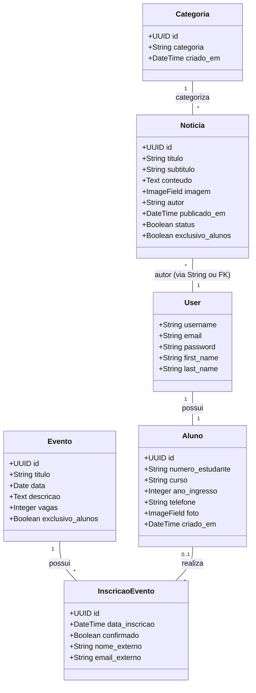

# Documentação Técnica - Portal de Notícias IPM

Este documento contém a arquitetura simplificada e os diagramas fundamentais do sistema.

## 1. Diagrama de Caso de Uso

O sistema possui dois atores principais: **Usuário (Visitante/Aluno)** e **Administrador**.

```mermaid
useCaseDiagram
    actor "Usuário Visitante" as Visitor
    actor "Aluno Autenticado" as Student
    actor "Administrador" as Admin

    package "Portal de Notícias IPM" {
        usecase "Visualizar Notícias" as UC1
        usecase "Filtrar por Categoria" as UC2
        usecase "Visualizar Eventos" as UC3
        usecase "Criar Conta de Aluno" as UC4
        usecase "Fazer Login" as UC5
        usecase "Inscrever-se em Evento" as UC6
        usecase "Gerenciar Perfil" as UC7
        usecase "Publicar Notícias/Eventos" as UC8
        usecase "Gerenciar Inscrições" as UC9
    }

    Visitor --> UC1
    Visitor --> UC2
    Visitor --> UC3
    Visitor --> UC4
    Visitor --> UC5

    Student --|> Visitor
    Student --> UC6
    Student --> UC7

    Admin --> UC8
    Admin --> UC9
    Admin --> UC1
```

## 2. Diagrama de Classe (Modelos Django)

Representação das entidades principais e seus relacionamentos no banco de dados.



## 3. Descrição dos Componentes

- **Categoria**: Organiza o conteúdo informativo (ex: Acadêmico, Esportes, Eventos).
- **Noticia**: O núcleo informativo do portal. Pode ser restrita a alunos.
- **Evento**: Atividades programadas com controle de vagas.
- **Aluno**: Extensão do modelo de usuário padrão do Django com dados acadêmicos.
- **InscricaoEvento**: Registro de participação, suportando tanto alunos quanto público externo (quando permitido).
